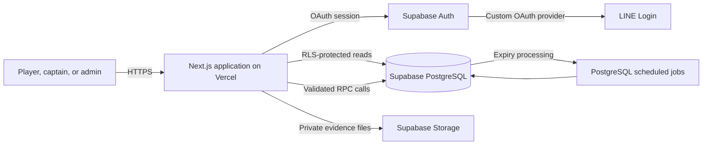

# MeQ

MeQ is a Thai-language web application for basketball courts at Naresuan University. It records team membership, court queues, check-in status, game results, player statistics, court calendars, and maintenance reports.

Live demo: [https://meq-starter-v01.vercel.app/](https://meq-starter-v01.vercel.app/)

The deployment is being tested. Access through LINE may be limited by the LINE Login channel's tester and publication settings.

## Project status

The application is undergoing multi-user testing.

- LINE Login is implemented.
- LINE Messaging is under development for future queue and match notifications.

## User flow

1. Sign in with LINE. MeQ creates or loads the player profile linked to that account.
2. Create or join one team. A 3x3 team needs 3 members and a 5x5 team needs 5 members before entering a queue.
3. Each member confirms their location. The captain then selects a compatible court queue.
4. When two teams are called, each captain confirms that the team is ready. The database starts the game after both teams are ready.
5. A captain requests the end of the game. Both captains submit their team's player scores.
6. The finalized result is added to game history and player statistics.

Each court has its own queue. The 3x3 A and 3x3 B courts share the daily 3x3 target-score setting. A team or player cannot be active in more than one queue.

The match rules allow a winner to stay for at most two consecutive wins, rest for one game on the same court, and then return. A losing team has three minutes to requeue.

## Technology

| Area | Technology |
| --- | --- |
| Web application | Next.js 16 App Router, React 19, TypeScript |
| Authentication | Supabase Auth with a custom LINE OAuth provider |
| Database | Supabase PostgreSQL |
| Authorization | Row Level Security, column grants, and role checks |
| Server operations | Next.js Server Actions and PostgreSQL RPC functions |
| File storage | Supabase Storage for maintenance evidence |
| Scheduled work | PostgreSQL scheduled jobs for database-owned deadlines |
| Deployment | Vercel |
| Tests and CI | Node test runner, pgTAP, GitHub Actions |

## Architecture



The browser receives a Supabase session cookie and uses the publishable key. Service-role credentials are not exposed to browser code.

PostgreSQL is the source of truth for team membership, queue position, check-in deadlines, games, score submissions, and player history. Queue transitions and game finalization are handled by database functions so the client cannot choose its own queue position, role, timer, or result.

Important database rules include:

- one active team membership per user
- one active queue per team and player
- full roster before queue admission
- court type must match team type
- one score submission per team and game
- one player-history row per player and game

RLS controls table access for signed-in users. Operations that change team, queue, game, or score state use RPC functions that check `auth.uid()` and the caller's role inside a transaction. Admin access is represented by the role stored in `profiles` and is checked again by admin operations.

Maintenance images are stored in a private Storage bucket. The database stores the object path rather than image data.

## LINE integration

LINE Login is implemented through Supabase Auth using the `custom:line` provider. When Supabase creates an auth user, a database trigger copies available LINE display-name and avatar metadata into the MeQ profile.

LINE Messaging is under development for future queue and match notifications.

## Engineering notes

- Database timestamps own queue and check-in deadlines. Browser timers are display-only.
- Games store roster and target-score snapshots so later team or setting changes do not rewrite completed results.
- The 3x3 courts use a shared court group for the daily target score while keeping separate queue entries.
- Business dates use `Asia/Bangkok` and start at 05:00.
- Queue and match rules are documented separately from UI components.

## Testing

Install dependencies before running the checks:

```bash
npm ci
npm run typecheck
npm run lint
npm run build
npm run test:unit
```

Database tests require Docker and the local Supabase stack:

```bash
npx supabase start
npx supabase db reset --local --no-seed
npm run test:db
```

GitHub Actions runs type checking, linting, a production build, unit tests, and pgTAP database tests for pushes and pull requests to `main`.

The current automated tests cover rule helpers, admin validation, production-surface checks, team and location rules, database privileges, team membership, queue management, and a full 3x3 database flow.

## Run locally

Requirements:

- Node.js 24
- npm
- a Supabase project for application testing
- Docker Desktop for local database tests

Create a local environment file from `.env.example` and set these runtime values:

```text
NEXT_PUBLIC_SUPABASE_URL=
NEXT_PUBLIC_SUPABASE_PUBLISHABLE_KEY=
NEXT_PUBLIC_APP_URL=http://localhost:3000
```

The LINE provider and its callback URL must also be configured in the connected Supabase project and LINE Developers console.

Start the application:

```bash
npm ci
npm run dev
```

Open [http://localhost:3000](http://localhost:3000).

## Repository guide

```text
app/                 Next.js routes, pages, and server actions
components/          UI components
lib/                 Business rules and Supabase repositories
supabase/migrations/ Database schema, RLS policies, and RPC functions
supabase/tests/      pgTAP database tests
tests/               TypeScript rule and production-surface tests
docs/requirements/   Product and queue rules
docs/architecture/   Backend boundaries and implementation notes
docs/diagrams/       Queue, team, game, auth, and database diagrams
```

Start with these documents when reviewing the repository:

- [`docs/requirements/queue-rules.md`](docs/requirements/queue-rules.md) for queue and match requirements
- [`docs/architecture/supabase-foundation.md`](docs/architecture/supabase-foundation.md) for the implemented backend boundary
- [`docs/diagrams/README.md`](docs/diagrams/README.md) for the diagram index
