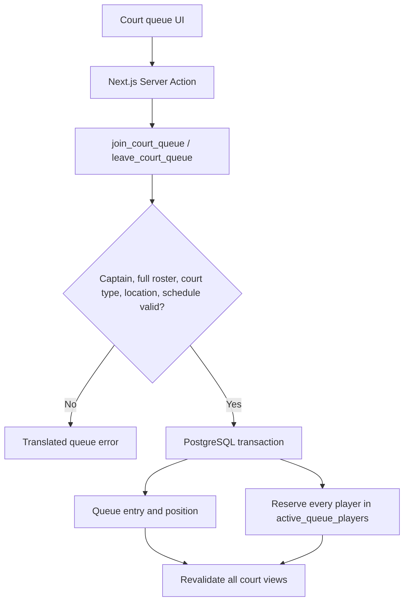

# Court queue with Supabase

`active_queue_players.user_id` and the partial unique team index prevent a team
or player from becoming active on more than one court. Queue order is recalculated
inside PostgreSQL when a waiting team leaves.
