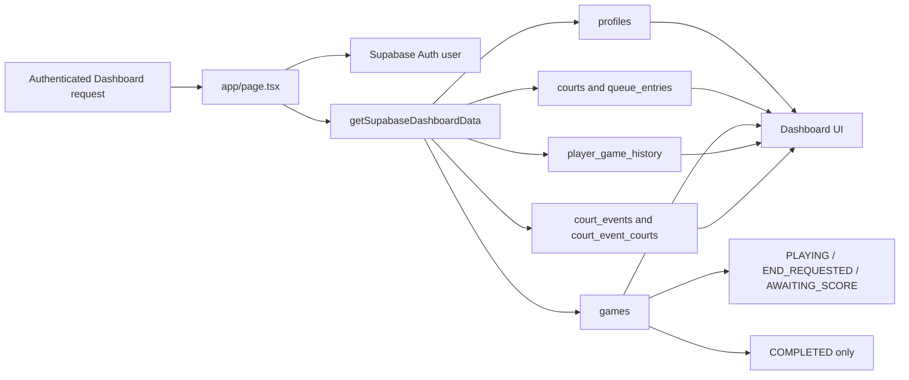

# Dashboard Supabase data flow

The authenticated profile, court state, queue counts, active games, completed
results, and player statistics now share Supabase as their source of truth.
Upcoming court events now come from Supabase. The maintenance-report
development workflow remains separate until its repository is migrated.
