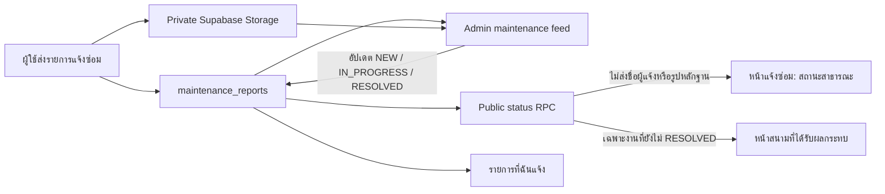

# Maintenance status flow

The public feed intentionally excludes reporter identity and private image paths. Resolved work remains visible on the maintenance page for seven days, but does not appear as an active court warning.
