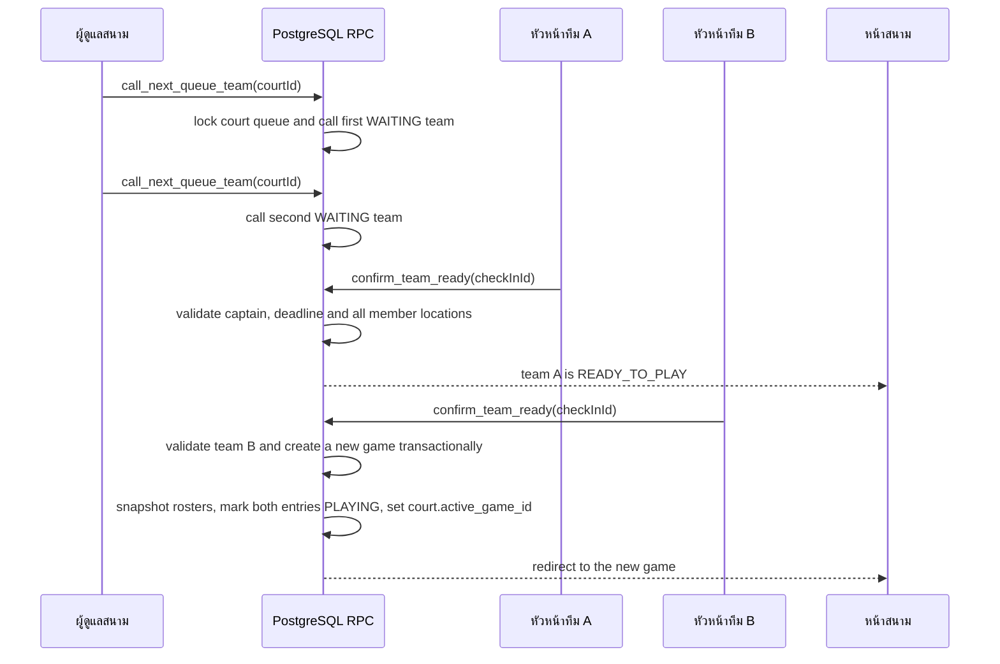

# Queue check-in on Supabase

The browser never supplies team membership, roster readiness, queue position,
target score, or game participants. Those values are resolved and validated in
PostgreSQL. Expired sessions are closed before another team is called.
