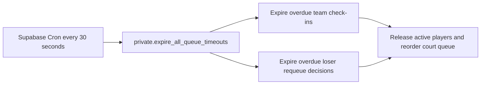

# Queue check-in on Supabase

```mermaid
sequenceDiagram
    participant Admin as ผู้ดูแลสนาม
    participant DB as PostgreSQL RPC
    participant A as หัวหน้าทีม A
    participant B as หัวหน้าทีม B
    participant UI as หน้าสนาม

    A->>DB: verify_court_location(courtId, coordinates, accuracy)
    DB->>DB: validate accuracy and distance; set a 10-minute expiry
    DB-->>UI: return each member's readiness and expiry
    UI->>UI: disable queue entry exactly when any verification expires
    A->>DB: join_court_queue(courtId)
    DB->>DB: revalidate full roster and every unexpired location
    Admin->>DB: call_next_queue_team(courtId)
    DB->>DB: lock court queue and call first WAITING team
    Admin->>DB: call_next_queue_team(courtId)
    DB->>DB: call second WAITING team
    A->>DB: confirm_team_ready(checkInId)
    DB->>DB: validate captain, deadline and all member locations
    DB-->>UI: team A is READY_TO_PLAY
    B->>DB: confirm_team_ready(checkInId)
    DB->>DB: validate team B and create a new game transactionally
    DB->>DB: snapshot rosters, mark both entries PLAYING, set court.active_game_id
    DB-->>UI: redirect to the new game
```



The browser never supplies team membership, roster readiness, queue position,
target score, or game participants. Those values are resolved and validated in
PostgreSQL. Expired sessions are closed before another team is called.
The browser expiry timer only updates the interface; queue admission always
revalidates location expiry against the database clock.
