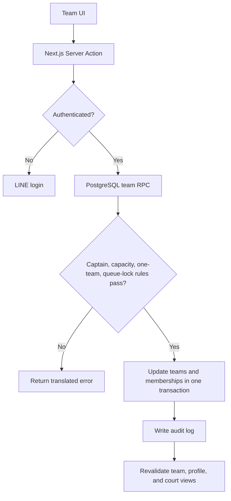

# Team management with Supabase

```mermaid
flowchart TD
  UI["Team UI"] --> SA["Next.js Server Action"]
  SA --> AUTH{"Authenticated?"}
  AUTH -- No --> LOGIN["LINE login"]
  AUTH -- Yes --> RPC["PostgreSQL team RPC"]
  RPC --> RULES{"Captain, capacity, one-team, queue-lock rules pass?"}
  RULES -- No --> ERROR["Return translated error"]
  RULES -- Yes --> TX["Update teams and memberships in one transaction"]
  TX --> AUDIT["Write audit log"]
  AUDIT --> REFRESH["Revalidate team, profile, and court views"]
```

Team mutations never write directly from browser code. PostgreSQL RPCs validate the
authenticated user again and preserve the existing queue-related roster lock.
